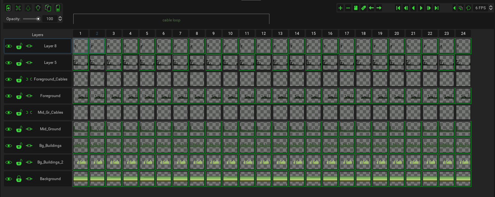

In Pixelorama, the term "Cel" (from [celluloid](http://en.wikipedia.org/wiki/Cel)) refers to the intersection of frames and layers of the project. Basically, every frame in a project has as many cels as there are layers. You could think of frames as a collection of cels, for every layer. So for example, if the project has 3 frames and 4 layers, each frame would have 4 cels, making the total cels 3 x 4 = 12.

Cels can be found in the timeline. They are the square buttons which you can click to edit. You can select/deselect multiple by holding the <kbd>Control</kbd> key and left-clicking individual cels, or hold the <kbd>Shift</kbd> key and left-click a cel to also select all of the cels between the one that was clicked and the one that has been selected last.

## Linked cels
You can also right click cels to link them together. Linked cels share the same image data, meaning that if you make changes to one linked cel, the changes are shared with all other linked cels. Keep in mind that, as of right now, linked cels are layer-local. You cannot have cels linked that belong to different layers, only different frames. Linked cels are marked with a green outline.
