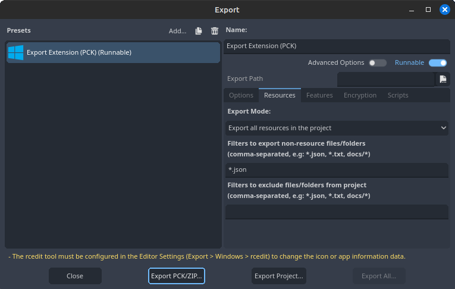
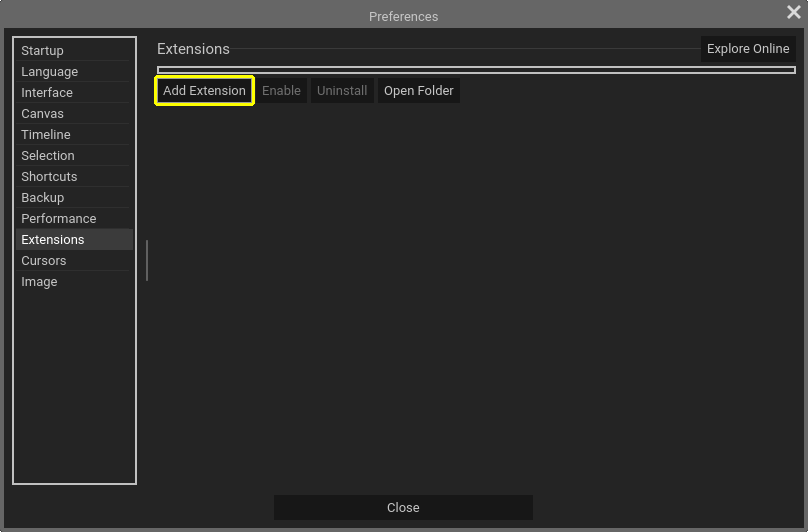

## Making an Extension
Since **Pixelorama v0.10**, you can add/remove extensions to/from Pixelorama. Extensions are distributed as PCK (.pck) or ZIP (.zip) files and you can manage them from **Edit > Preferences > Extensions**. This is a step-by-step guide of how you can make an extension for Pixelorama. For this tutorial the extension we'll make will be called "Example" 

### Prerequisites
First of all, there are a few prerequisites for you to start creating extensions.
- Some knowledge of GdScript.
- A ready to use [Godot executable](https://godotengine.org/) (See the [Pixelorama Channgelog](https://github.com/Orama-Interactive/Pixelorama/blob/master/CHANGELOG.md) to figure out which version to use).
- [Source code](https://github.com/Orama-Interactive/Pixelorama/releases) for your target version of Pixelorama (This is optional but will speed up your debugging workflow).

### Process
:::tip version control
To ensure your work isn't accidentally lost, it is highly recommended that you use version control (e.g Git) in your extension project. 
:::

1. First of all make a new Godot project of name "Example" (the project name is irrelevant but for simplicity we'll name it the same as our extension).
2. After that make a directory structure as shown in the image below.


##### The File Structure of any basic extension.

In the "Example" folder you can see three files;
- extension.json
- Main.tscn
- Main.gd

These files are the bare minimum required for an extension to function properly. Let's go through each of them one by one:

### extension.json

The `extension.json` file serves as a basic configuration file for the extension. A proper `extension.json` file should contain the below content
```
{
    "name": "Example",
    "display_name": "Anything you want",
    "description": "What the extension does",
    "author": "Your Name",
    "version": "0.1",
	"supported_api_versions": [4],
    "license": "MIT",
    "nodes": [
        "Main.tscn"
    ]
}
```
| Key      | Description |
| ----------- | ----------- |
| name | The extension name (in this case Example). |
| display_name | The name actually shown by Pixelorama in it's extension list (it can be anything). |
| author | Author of the extension. |
| version | version of the extension, it is a floating value so versions like 20.1.7 etc. are invalid. |
| supported_api_versions | (Optional) Announces the Api level of the extension. Pixelorama uses this to check compatibility between versions. |
| license | Name of license used by the extension. |
| nodes | Array containing name of scenes that should be instanced as soon extension gets enabled (in this case it is `Main.tscn`). |

:::tip Api Versions
`supported_api_versions` is an optional key that is used by Pixelorama to determine if it is compatible with it's Api ( E.g `[ 3 ]` means you are making extension for Pixelorama 0.11.x). If your extension is compatible with multiple api e.g (level 2 and 3) then use `[ 2, 3 ]`. To find the Api level of Pixelorama open the `project.godot` file in **Pixelorama's Source** and look for `config/ExtensionsAPI_Version`
:::

### Main.tscn
As mentioned above, the `Main.tscn` will be instanced in Pixelorama as soon as the extension gets enabled. a GdScript file (In this case `Main.gd`) is attached to this scene.

### Main.gd
As mentioned above, the `Main.gd` is a script written in GdScript, that will be run as soon as the extension gets enabled. It can be used to
- Instance further scenes (.tscn files).
- Or contain the core extension code.

The content of a basic `Main.gd` file is;
```
extends Node

# NOTE: use get_node_or_null("/root/ExtensionsApi") to access the extension api.

# Runs as soon as extension is enabled. This script can act as a setup for the extension.
func _enter_tree() -> void:
	pass


func _exit_tree() -> void:  # Extension is being uninstalled or disabled
	# remember to remove things that you added using this extension
	pass
```

## Exporting the Extension
:::info Export Templates
Downloading/Installing export templates is not required for `.pck` export.
:::

Now that you have the basic extension code ready, let's export it;
1. From the top bar in Godot editor go to **Project > Export** and choose any platform option (the extension should work on other platforms regardless of which platform you choose).

2. In then go to the **Resources** tab and do the following changes;
   - **Export Mode** should be set to `Export all resources in the project`
   - **Filters to export non-resource files/folders** should be set to `*.json`
   - **Filters to exclude files/folders from project** can remain empty.


##### Extension Export Options.

3. After that, press <kbd>Export PCK/Zip</kbd> and export it as a PCK file (both Zip and PCK extensions are recognized by Pixelorama but PCK is recommended). The name of exported pck should be the same as the `name` of your extension, in this case it should be `Example.pck`

## Installing the Extension

To install an extension, from Pixelorama's top menu go to **Edit > Preferences > Extensions** and click <kbd>Add Extension</kbd>.

:::tip Drag and Drop
A more easier way would be to drag and drop the extension in Pixelorama.
:::



##### Adding an Extension.

After it has appeared in the list of extensions, select it press <kbd>Enable</kbd>.


## Debugging an Extension
:::tip Faster Workflow
During debugging, it is way faster to export the `.pck` directly to the extensions folder. To get path to that folder, go to **Edit > Preferences > Extensions -->**<kbd>Open Folder</kbd>
:::
In order to debug an extension, you need to have the source-code of your target version of Pixelorama open in another godot instance. To start debugging, **run pixelorama through godot** and follow the steps mentioned in [Installing the Extension](#installing-the-extension). The debug messages for the extension will appear in the Godot instance that's running the Pixelorama's source-code.


##### Debugging of an extension (stack trace shown as a result of non existent function).
