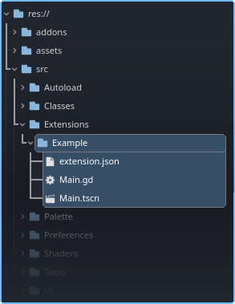
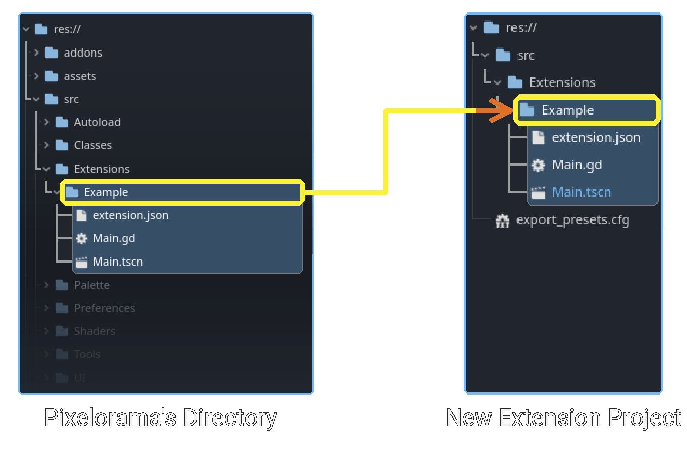
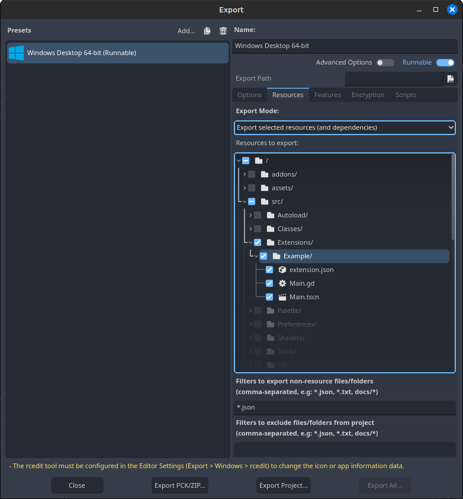

Internal extensions are extensions that are not `.pck` files, but actual code (arranged in the same format as you would an extension) in `res://src/Extensions/`.

The concept of internal extensions was origally targeted towards potentially making pixelorama more modular by grouping some of it's features into smaller extensions, but it can also be used in developing of extensions by users.

We will refer to our extension as "Example"

## Comparing the two methods

        | Internal Extensions | Standard way (as separate project) |
        | --- | --- |
        | Both ways are easily interchangeable | Both ways are easily interchangeable |
        | During development you don't have to export a pck, every time you need to debug the extension | To debug you'd have to re-export your extension which is time consuming |
        | Pixelorama's source code is required | Creating the Extension project is required but Pixelorama's source code is optional |
        | You can extend pixelorama's classes (like BaseTool) | You can still extend classes, but Godot's code editor will complain (it's perfectly fine but it's not very pleasing to the eye) |

## Making an Internal Extension
:::tip converting external extension
The process for converting an **existing** external extension into an internal extension is almost the same as this. Instead of making files (step 3), you copy them over.
:::

1. Get and unzip the [source code](https://github.com/Orama-Interactive/Pixelorama/releases) of pixelorama that you intend to use for your extension.
2. Create an `Extensions` folder (case sensitive) in the pixelorama's source code inside the `res://src` folder.
3. Make the necessary files mentioned in step 2 of [this tutorial](./extension_basics#process). Your directory structure will resemble something like this

    

4. Navigate to the `res://src/Extensions/(extension name)/extension.json` file and copy the value of the `name` key. Then open `res://src/HandleExtensions.gd` file in pixelorama's source and find the `_add_internal_extensions()` method. Modify and save it as follows:
    ```
    func _add_internal_extensions() -> void:
        _load_extension("Example", true)  # Add this line, and replace `Example` with the value of your `name` key.
    ```
Now the extension has become internal. From here you can continue to code in the `res://src/Extensions/<your extension>` folder of pixelorama (just don't create any files in outside your extension folder).
:::tip Accessing the API
In an internal extension, prefer using `ExtensionsApi` autoload directly instead of `get_node_or_null("/root/ExtensionsApi")`
:::

## Exporting an Internal Extension
When you are ready to release/distribute your extension to the public, you may choose one of the following ways.
### Converting an Internal Extension into an External one

These steps are basically the reverse of the steps mentioned in the previous section.
1. Make a new Godot project called "Example" (the **project name** is irrelevant but for simplicity we'll name it the same as our extension).
2. Remove/comment the line that was added to `res://src/HandleExtensions.gd` (In step 5 of [Making an Extension, internal](#making-an-extension-internal)). This step is not compulsory but is mentioned anyway for the sake of completeness.
3. From Pixelorama, move/cut your extension folder from `res://src/Extensions/Example`, To the `res://src/Extensions/Example` folder of your project (replacing existing files).

    

4. Now you can safely delete pixelorama's source code if you want (or use it for some other extension).
5. Export your extension, using steps from [this tutorial](./extension_basics#exporting-the-extension).


### Direct export of Internal Extension
Internal extensions can be exported directly instead of first converting it to an external extension.
1. Form the Godot editor, go to `Project -> Export...`.
2. In the Export dialog, add a new preset (any preset will work) and go to the Resources tab.
3. Write `*.json` in *'Filters to export non-resource files/folders'*. and in **Export Mode**, Choose *'Export selected resources (and dependencies)'* and select only your extension files as shown below.

    

4. Press the `Export PCK/ZIP` button and export with the **same name as your extension**.
