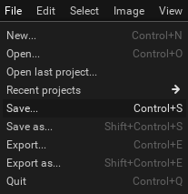

In Pixelorama, the term "Project" refers to the entire sprite, which contains all of the frames it might have. Each project can be saved as a `.pxo` file. Multiple projects can be opened in Pixelorama at the same time, with each one having its own tab.

A Project contains the following properties:
- A set of frames for animations, along with their duration, animation tags and FPS, as well as multiple layers. Frames and layers intersect and create [cels](cel), which are the editable images themselves of the project.
- A size - width and height - in pixels.
- A name.
- [Brushes](brush) that are local to that specific project.
- [Guides](canvas/#rulers-and-guides) - lines that help you draw.

To save a project, you can go to the File menu and select Save, or press <kbd>Control + S</kbd>. If you are using a Desktop version, you will be able to choose where you want the file to be saved. If you use the Web version, you will be asked for a file name and the .pxo file will be downloaded by your browser.

