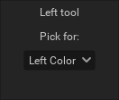

## An Introduction to how the Tool Options Work

Pixelorama's tool options are located in about the middle of the right UI panel as indicated in the picture:

##### By default the left tool corresponds to the brush tool and the right tool corresponds to the eraser tool. This is also indicated on the toolbar, because the brush tool button appears half-blue and the eraser half-orange.

## The available tools are (by the order they appear on the toolbar):
 1. Rectangular Selection
 2. Zoom
 3. Color Picker
 4. Pencil
 5. Eraser
 6. Bucket
 7. Lighten/Darken

From the toolbar, if you right-click a tool you will see its available options at the right tool options and if you left-click a tool you will see its available options at the left tool options. As seen on the picture above, the right and left tool options are seperated visually, with the left being on the left and the right being on the right. 

**Each side corresponds to a click on the canvas.** That means that if you left-click on the canvas, you will be using the left tool that you selected from the toolbar with the left tool options that you adjusted on the tool options. 

Let's see an example indicating the connection of the toolbar with the tool options:

As you can see from the toolbar above, the left click is mapped for the bucket tool and the right click is mapped for the zoom tool. That means that the left tool options reflect to the bucket tool and the right tool options reflect to the zoom tool. 

Note that the selected colors (above the tool options) also have a left and right logic, meaning that the left tool will be using the left color (in this example black) and the right tool will be using the right color (in this example white). Not all of the tools have color options though, for example the right color does not affect the zoom tool at all since it has nothing to do with color.

Although, other than the right and left click mapping, there is no difference between the left and right tool options, it would be good to clarify that for the sake of the documentation, the tool option explanations will be mainly happening for the left tool options. The same principles apply for the right tool options too.

## The Rectangular Selection Options

For now the rectangular selection has no tool options, so when you click the tool it looks like this:

*Selections are used for multiple purposes. For example you can use a selection if you want to edit only a predefined area instead of the whole canvas. Another use for the selection could be to move an element of your artwork without having to erase it and redraw it from scratch. Layers compliment the selection's use since a seletion only affects the current layer and not all of them. Be sure to combine the use of selections with the use of layers to make your workflow more optimized!*

It is worth noting that there are some hotkeys regarding the rectangular selection that apply on the canvas. Those are:

**Ctrl+C** to copy the selection's contents, and **Ctrl-V** to paste them.

**Delete** to delete its contents.

**Shift+Mouse Click and move** To move the selection with its contents.

**Mouse Click and move** To move the selection without its contents.

##### *Mouse click can either be left click or right click, depending on where the tool is mapped. Also the hotkeys may vary for Mac users.

**To clear a selection** go to Edit>Clear Selection

**There is no way to add another selection yet, it will be a feature of a future update**

## The Zoom Options

If you select the zoom tool, the zoom options by default look like this:

*The zoom tool's purpose is to make it easier for the user to draw something, since they can zoom in to draw details and zoom out to see how those details affeted the greater image!*

As you can see, there are 2 categories here. Mode and Options. By default the mode is set to "Zoom in", but if you press it, you can switch it so "Zoom out". This means that whenever you click on the canvas with the mapped click (left or right depending on which side you have the tool selected from), it will act accordingly.

**This is especially useful for tablet users with no mouse** since you can alternatively scroll up and down with your mouse to zoom in/out without the use of the zoom tool.

As for the options, there are 2 different buttons. 

The first one it "Fit to frame" which basically centers your canvas and makes it as big as possible without any portion of it not being visible.

The second one is 100% zoom. This basically makes the canvas its exact pixel dimensions based on your screen. For example if your canvas is 64x64 pixels, pressing this button will make the canvas appear on a 64x64 area of your screen. This gives you an idea of how your art looks at its original dimensions.

*It is worth noting that the current zoom % of your canvas appears, and changes dynamically, at the top menu bar in the middle, as shown on this image:

## The Color Picker Tool

Selecting the color picker tool will result in the appearance of the following option:

This one is fairly simple to comprehend. The color picker tool is used for getting a sample of an existing color on the canvas with the purpose of replicating it, depending on which pixel the selection is done at.

Now, there's only one category available as an option for the time being, called "Pick for:". This means that the sample taken will replace the color on the **selected colors** according to whether you choose **Left Color** or **Right Color**. Choosing **Left Color** replaces the left selected color, while right replaces the right selected color. 

*Tip: A quick and helpful way to use the color picker is having it selected on your* ***right click*** but on the ***Left Color*** option *while having the* ***brush tool*** *selected on your* ***left click.*** *The color picker can compliment the brush by selecting the color you next desire to paint with, making it an immediate way of switching between hues.*
## The Brush Tool

-Section Under construction-

## The Eraser Tool

-Section Under construction-

## The Color Bucket Tool

-Section Under construction-

## The Lighten/Darken Tool

-Section Under construction-

## Making Your Own Custom Brushes

-Section Under construction-

## Making Your Own Custom Tiles

-Section Under construction-

