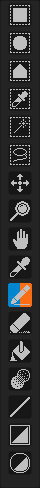

###### One of the first things you'll come across when you launch the program is this toolbar on your left.

### Pixelorama's toolbar looks like this:

###### Here you'll find the tools you'll be using to create whatever your heart tells you. This list is bound to change/expand in future updates. 

## The tools you see in order are:
##### 1. Rectangular Selection
##### 2. Zoom
##### 3. Color Picker
##### 4. Pencil
##### 5. Eraser
##### 6. Bucket
##### 7. Lighten/Darken

###### Hovering your mouse over the tool of your choice will result in a small display that describes it further. It will look like this:

###### Note that some of the tools are half blue and half pink. Blue represents the left click and pink represents the right click. So, if for example you left click on the pencil tool, its icon will turn half blue, indicating that this tool is mapped for the left click. If you right click on another tool, its icon will turn half pink, indicating that it's mapped for the right click. So, every time you are on your canvas, if you left click, the tool that you left clicked on the toolbar will be used and if you right click, the tool that you right clicked will be used. You can left and right click the same tool, making it both blue and pink, indicating that this tool will be used by either click on the canvas. Some alterations can seen below:

