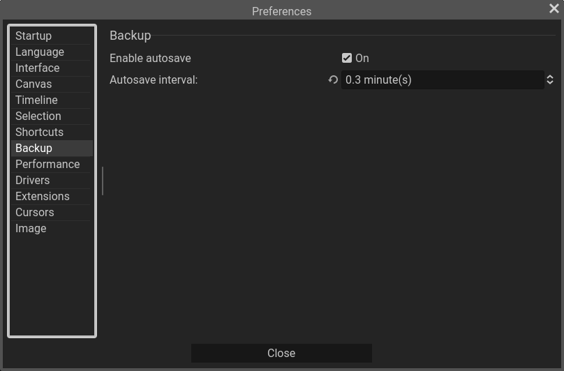
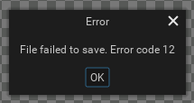

This page lists common issues encountered when using Pixelorama and possible solutions. To experience as less issues as possible, make sure you are always using the latest stable version of Pixelorama.

## Pixelorama crashed while I was working on my project!
Crashes are unfortunate, and while we are doing our best to fix them, it is possible that some issues that cause the application to crash have escaped our grasp. The good news is that you can enable **automatic backups**, that save your work every a certain time interval. You can enable them from the Edit menu, Preferences, Backup and then by ticking on "Enable autosave".

Besides that, it is **strongly recommended** that you save often, and keep copies of your files as backups in case something gets lost.

You can also aid us in our fight against crashes by [reporting issues on GitHub](https://github.com/Orama-Interactive/Pixelorama/issues) and uploading the contents of Pixelorama's log files. You can find the log files in `C:\Users\[USERNAME]\AppData\Roaming\Godot\app_userdata\Pixelorama\logs` on Windows, `~/.local/share/godot/app_userdata/Pixelorama/logs` on Linux and `/Users/[USERNAME]/Library/Application Support/Godot/Pixelorama/logs` for macOS. It is also extremely helpful, if not necessary, to be as specific as possible with the steps that led to the crash. By giving us specific steps to reproduce the issue, we can solve it faster.

## macOS says that Pixelorama is damaged!
You may encounter some errors saying that Pixelorama is damaged. This is because the latest versions of MacOS mark the launcher of unknown binaries as a non-executable file. This most likely has to do with the fact that Pixelorama is not signed. 

Read this guide for more information: https://disable-gatekeeper.github.io/

## I have performance issues, Pixelorama is very slow on my machine
We are doing our best to optimize the performance. That being said, you can improve the performance of the app significantly by changing its maximum framerate, in order to reduce CPU usage. To do that, you can go to the Edit menu, Preferences and clicking on the Performance tab. There, you can set a maximum value for the FPS in "Set application FPS limit:". Keep in mind that the lower the number, the lower the CPU usage, but the application gets slower, choppier and unresponsive, so make sure not to set it *too low*. 0 means that there is no limit.

If you have a specific performance issue you'd like us to look at, feel free to [open an issue on Pixelorama's GitHub Repository](https://github.com/Orama-Interactive/Pixelorama/issues).

## I have a hiDPI monitor and the User Interface is very small!
It is possible to change the scale of the UI, by going to the Edit menu, seelcting Preferences and going to the Interface tab. There, you can change the display scale, which goes from 1 (smallest) to 4 (biggest). 4 essentially means that the UI will be 4 times bigger than the default UI. Then, you click Apply to set the changes. Keep in mind that it's best to use integer values, such as 1, 2, 3 and 4, otherwise the UI may appear blurry.

## Error code 12 when exporting png files

This error has only been spotted in the Windows platform. Sometimes, when exporting png files, the process may fail due to "Error code 12". This most likely happens when you try to export in a directory that is protected by **anti-virus software**. To resolve it, you can try tweaking the settings of your anti-virus to either whitelist Pixelorama or disable folder protection. We can't guarantee that this will work, as it also depends on what anti-virus software you are using. Alternatively, you can export in a directory that is not protected by the anti-virus.

It is also possible that this issue may be solved if you run Pixelorama as an administrator.

If neither of these works, you could save your projects as a pxo file, open the Web version, drag and drop the pxo file there, and export the png file from the Web version.

## Drawing is very slow when using a drawing tablet
If you are on Windows, try disabling Windows Ink, as it is known to create some problems with Pixelorama.

## Guides are not being created
To create guides, you have to drag them out from the rulers, on the top and on the left of the canvas. However, sometimes this doesn't appear to do anything. There are two possibilities for this.

1) You have disabled guide visibility. To make sure that they are visible, go to the View menu and see if "Show Guides" is ticked on. If it is not, make sure to tick it.

2) A known bug is preventing guide creation. This is related to [Issue #331](https://github.com/Orama-Interactive/Pixelorama/issues/331) on GitHub. To work around this, you can just make a simple change to the image, like drawing, and then you can try dragging a guide again. We are working on finding a solution for this issue.
