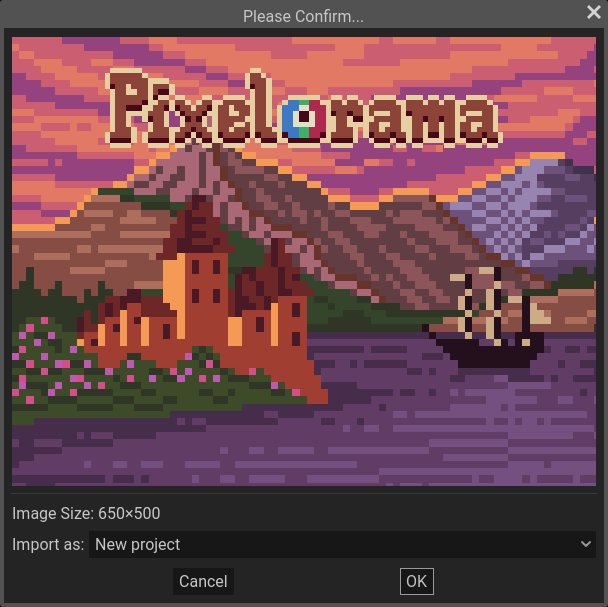

In Pixelorama, it is possible to import [.pxo files](../concepts/project/#pxo-files), image files, [palette files](palettes) and [extension files](../extension_system/extension_basics). To import a file, either `drag and drop` it into Pixelorama window or use `File > Open` dialog. You can also open files in Pixelorama through the your computer's file explorer by right clicking on a file, selecting "Open with" and selecting Pixelorama, but the process of making this work is different for each operating system/desktop environment. Doing this will open Pixelorama with the file automatically opened. You can also achieve the same thing by opening Pixelorama through the command line, and giving the names of the files you want to open as arguments.

## Supported image formats
The image formats that can be imported are: `.png`, `.apng`, `.jpg`/`.jpeg`, `.webp`, `.bmp`, `.svg`, `.tga`, `.hdr`. Pixelorama can also import more complex image file formats, such as our own `.pxo`, as well as [OpenRaster](https://www.openraster.org/) (`.ora`) and Aseprite's `.ase`/`.aseprite`.

## Import image options
When attempting to import an image, a dialog will appear, containing a preview of the image you want to import, along with options that let you change how you want the image to be imported.

These options include:
- New project, that lets you open the image as a new project
- Spritesheet (new project), that lets you open the image as a spritesheet in a new project. You can manually set the amount of horizontal and vertical frames, or select "smart slice", which attempts to figure out the amount of frames in the spritesheet automatically.
- Spritesheet (new layer). Same as above, but instead of opening the spritesheet in a new project, it opens it as a new layer in the currently active project.
- New frame, which opens the image as a new frame in the currently active project. You can specify which layer the new frame will belong to.
- Replace cel, which replaces a cel at the frame and the layer of your choosing, with the imported image in the currently active project.
- New layer, which opens the image as a new layer in the currently active project. You can specify in which frame the new layer will be at.
- New reference image, which opens the image as a reference image in the currently active project.
- New palette, which creates a new [palette](palettes) using the colors of the imported image.
- New brush, which opens the imported image as a [brush](../concepts/brush). You can choose whether the new brush will be a file brush, a project brush, or a random brush.
- New pattern, which opens the imported image as a pattern, which can be used by the bucket tool.
- Tileset, which can be used by [tilemap layers](tilemaps). You can manually set the amount of horizontal and vertical slices, or select "smart slice", which attempts to figure out the amount of frames in the spritesheet automatically.

## Importing multiple images
When importing multiple images at the same time, the import dialogs will also have an "apply to all" checkbox. When toggling this on in a dialog, the rest of the dialogs will hide and all of the imported images will share the same options. This way you can easily import multiple images as multiple projects, frames, layers, etc. The order that they are being imported is backwards, meaning that the the last image that you attempted to import, will be the first one that actually gets opened. For example, if you attempt to import image files named `1.png`, `2.png` and `3.png` in that order as new frames, the first frame would be image `3.png`, then `2.png` and then `1.png`.

## Importing videos
It is also possible to import video and gif files, and Pixelorama will automatically import them as multiple frames. For this, you need [FFMPEG](https://ffmpeg.org/). All you have to do is download it if it's not already installed, and then find its **executable path** and copy it inside Pixelorama, in `Edit>Preferences>Startup>FFMPEG`. If you have FFMPEG in the PATH environment variable of your Operating System, you can just put "`ffmpeg`" in the text field in the Preferences, instead of copying the path. Otherwise, make sure to include the entire path to the executable. For example, on Windows, it needs to look something like this: `[path_to_ffmpeg]/bin/ffmpeg.exe`.

:::caution Large files
Be careful not to import videos that are too big. Pixelorama is not yet optimized for importing large amount of frames which are common in videos, so it is possible that it will run out of memory and potentially crash.
:::

## Importing Aseprite files
Pixelorama can import Aseprite files, with the following features supported:
- Pixel, group & tilemap layers with their cels and preserved layer hierarchy (groups & children)
- Linked cels
- Layer blend modes, visibility/locked/collapsed, layer/cel opacity, layer name, color etc
- Projects with RGBA, Grayscale* and Indexed** color modes
- Frame tags
- Frame duration
- Tilesets
- Tilemap offset & cell transformations (rotation & flip)
- User data for projects, layers, frame tags & cels

Does not yet support:
- Palettes. Will be supported once we add project palettes in Pixelorama.
- Slices. Will be supported once we add slices (or a similar concept) in Pixelorama. Related: [#812](https://github.com/Orama-Interactive/Pixelorama/discussions/812)
- Cel extra, color profile, external files & mask.

\* Aseprite projects with grayscale color mode are being converted to RGBA color mode when imported in Pixelorama, as Pixelorama does not support this color mode at the moment.

** While projects using indexed mode are being imported, their internal palettes are not, meaning that the colors will be different when importing the Aseprite file in Pixelorama, if the currently selected palette is different. To see the same colors, you need to bring the palette over from Aseprite into Pixelorama and select it. Once we add project palettes in Pixelorama (palettes that are being stored inside the project instead of being global), this will be fixed.
