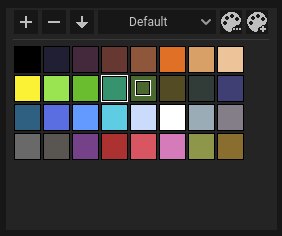
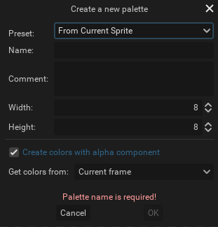

Palettes are a way to organize colors in your projects.

Pixelorama ships on most platforms with two pre-made palettes (`Default` and `Pixelorama`). These palettes can be freely modified.

All palettes are physically stored on disk in Pixelorama data folder.

:::danger undo/redo
Palettes currently don't support undo/redo so be careful with any modifications because they are permanent.
:::

## Palettes panel

The top of the panel consists of [`tools`](#palette-grid-tools) (used to edit colors of the palette), `Palettes selector`, [`Edit palette button`](#editing-palette-metadata) and [`Add new palette button`](#creating-new-palette).

The main section is the [`Palette grid`](#palette-grid), displaying all colors present in the currently selected palette.

### Creating a new palette {#creating-new-palette}

A new palette can be created by clicking `Add new palette button`.

#### Preset
You can select one of the presets to initialize a new palette with colors.

| Preset | Description |
| ------ | ----------- |
| Empty | Empty palette with no colors. |
| From Current Palette | Palette will be created with colors copied from the currently selected palette. |
| From Current Sprite | Colors will be imported from the currently opened image. |
| From Current Selection | Colors will be imported from the current selection. |

#### Name
The name of the palette is also used as a palette file name.

#### Comment
The palette's description. Default Pixelorama palettes use this field to credit palette authors.

#### Width and Height
Palettes have set width and height (can be resized later) which define their grid size. Allowed values are from 1 to 64.

#### Create colors with alpha component
If this option is not toggled on, colors will be imported without alpha channel and transparency is ignored.

#### Get colors from

You can limit colors import to just some or all cels (as seen in the animation timeline).

| Option | Description |
| ------ | ----------- |
| Current frame | Colors imported from currently selected frame and all of its layers.  |
| Selected cels | Colors imported only from selected cels. |
| All frames | Colors imported from all frames and their layers. |

### Editing palette metadata {#editing-palette-metadata}

Currently, selected palette metadata can be edited with `Edit palette button`.

The majority of properties are identical to create a new palette dialog.

:::caution palette resizing
If the palette size is reduced positions of all colors will be reset to the beginning of the palette. If some colors don't fit in the new size they will be removed!
:::

#### Name
If the palette name is changed the file name will also be changed accordingly.

#### Path
Displays where exactly in the file system the palette file is located.

#### Delete button
Permanently removes the palette from the file system.

## Palette grid {#palette-grid}

Displays all colors present in the palette. Colors in the grid can be interacted with.

| Interaction | Description |
| ----------- | ----------- |
| `Left click` | Color will be left selected and set as the left tool color. |
| `Right click` | Color will be right selected and set as the right tool color. |
| `Double click` | Double click on an existing color opens a color picker to change it's color. |

:::tip palette grid panning
If palette size is greater than `8x8` it can be panned in the grid either with sliders or `Middle click + Mouse drag`.
:::

### Tools {#palette-grid-tools}
Tools allow you to edit colors in the palette.

| Button | Tool | Description |
| -----  | ---- | ----------- |
| `+` | Add a new color | Left mouse click adds left tool color. Right mouse click adds right tool color. |
| `-` | Remove a selected color | Left mouse click removes left selected color. Right mouse click removes right selected color. |
| `↓` | Palette sorting options| A drop-down appears, containing the available sorting options. You can either apply the new color order directly to palette or to a copy of it. |

### Colors movement
Colors can be moved and copied around in the palette grid.

| Shortcut | Movement description |
| -------- | -------- |
| `Mouse drag` | Color switches with a color it is dropped on. |
| <kbd>Shift</kbd> + `Mouse drag` | Color is inserted where dropped. If dropped on another color the original color is moved to the right with every color next to it. |
| <kbd>Ctrl</kbd> + `Mouse drag` | Color is copied where dropped. If dropped on another color the original color is overwritten. |

## Palettes import
To import a palette, either `drag and drop` a palette file into Pixelorama window or use `File > Open` dialog.

An imported palette will be converted to `Pixelorama palette`, stored physically in the Pixelorama data folder and added to the palettes selection in `Palettes panel`.

The only exception to import behavior is `Image palette`. Importing an image to Pixelorama will open `Import Options` dialog in which you can select `Import as > New palette` to process an image to import a palette.

:::tip palette extraction
You can import any image as a palette and extract colors from it. Every color from the image will be added to the palette only once. With bigger images, it can take longer time to finish.
:::

### Supported formats

| Format | File extension |
| -------- | --------  |
| Pixelorama palette | .json |
| GIMP GPL | .gpl |
| PAL | .pal |
| Image palette | .png, .bmp, .hdr, .jpg, .jpeg, .svg, .tga, .webp |

:::caution file extensions
Palette format detection uses file extensions to determine how to parse palette formats. An incorrect extension will result in an import error.
:::

:::caution pre-1.0 pixelorama palettes
Palettes created in versions of Pixelorama prior to 1.0 cannot be reimported. The save format was changed from `.tres` to `.json`, due to security concerns. In order to convert an old palette to a new one, you can export it as an image from version 0.11.4, and import that image to the newest version.
:::
