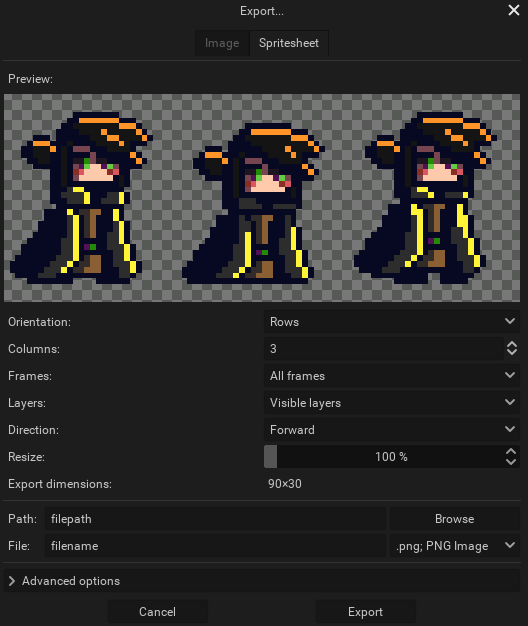

You can either save or export your projects. Saving a project will create a [.pxo file](../concepts/project/#pxo-files), which is Pixelorama's custom file format, while exporting means that one (or multiple, in case of animations) `.png`(s), an `.apng`, or a `.gif` file will be created.

:::tip saving vs exporting
Basically, you should **save** your project if you intend to use it again on Pixelorama and keep all of your data, such as layers, [project brushes](../concepts/brush/#project-brushes), animation tags, etc. While, if you want to share your artwork, import it in another software such as a game engine, or view it on an image editor, you should **export** it. Of course, nothing is stopping you from doing both, which is actually the recommended approach.
:::

## Saving

To save a project, you can go to the File menu and select `Save..`, or press <kbd>Control + S</kbd>, and a window will appear. If you are using a Desktop version, you will be able to choose where you want the file to be saved. If you use the Web version, you will be asked for a file name and the `.pxo` file will be downloaded by your browser.

By selecting `Save...` again on a project you have already saved, the file name and path you chose before will still be automatically used, which means that the old file will be replaced with a new one with the changes you have made. If you'd like to save a different file, you have to use the `Save as...` option, or press <kbd>Shift + Control + S</kbd>.

## Exporting
To export your project, you can go to the File menu and select `Export...`, or press <kbd>Control + E</kbd>, and a window will appear. If you are using a Desktop version, you will be able to choose where you want the file to be saved. If you use the Web version, you will be asked for a file name and the `.png`, `.apng` or `.gif` file(s) will be downloaded by your browser.

Just like with save, you have to use the `Export as...` option or <kbd> Shift + Control + E</kbd> to export to a new directory.

You can choose what you want to export by clicking on one of the tabs on the top of the window.

:::tip resize while exporting
If you draw on a small canvas, the exported image will have a relatively slow resolution. Some software and websites tend to blur small images, which can make pixel art look bad. To avoid that, you are also given the option to resize on export, with a chosen interpolation method. This is useful when you want to share your art and make it easier for people to preview it. For most cases, sticking with the default Nearest interpolation should be fine.
:::

You can choose which frames you want to save by changing the "Frame" option below the preview. The default setting is to include all frames, but you can set it to only include the currently selected frame, or select specific tags. Similarly, you can select which layers you want to include by changing the "Layers" option. You are also given the option to select the animation direction from either forward, backward or a ping-pong loop.

### Export a sequence of images

By default, the export window is set to export a sequence of images, one for each frame, either as multiple files, or as a single animated file, if the file format is set to an animated image format, such as `.gif` or `.apng`.

If you save your animation as multiple files, then every file will have a number attached to its name. For example, if the name is `filename.png`, the exported file names will be `filename_0001.png`, `filename_0002.png`, `filename_0003.png` and so on. In the advanced options, you can find options to change the separator character(s) (in the above example, the character is the underscore (`_`), which is also the default). If these frames also have a frame tag, the name of the tag can be included in the file name as well, by enabling "Include frame tags in the file name". You can also choose to automatically create a new directory for each frame tag for extra organization, by enabling "Create new folder for each frame tag". This will place all of the frames of the same tag in a different directory.

Keep in mind that if you are working with a large canvas size and/or multiple frames, the `.gif` exporting process can be slow. Until we speed up the process, it is recommended to export to `.apng` and use another tool, such as https://ezgif.com/apng-to-gif, to convert the `.apng` file to `.gif`.

### Export a spritesheet

You can save the entire animation as a single image containing all of the frames. This is called a `spritesheet`. You can choose how many rows and columns you want your animation to be split into, in the spritesheet. Spritesheets can also be imported into Pixelorama.

##### The above project exported as a gif file with Pixelorama

### Export a video
You can also export to various video formats. The process is similar to [exporting a sequence of images](#export-a-sequence-of-images), but Pixelorama is not able to export to video by itself. For this, you need [FFMPEG](https://ffmpeg.org/). All you have to do is download it if it's not already installed, and then find its executable path and copy it inside Pixelorama, in `Edit>Preferences>Startup>FFMPEG`. If you have FFMPEG in the PATH environment variable of your Operating System, you can just put "`ffmpeg`" in the text field in the Preferences, instead of copying the path.
