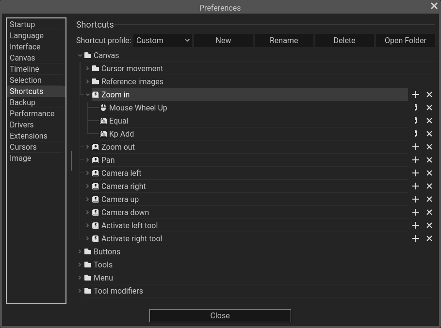

Pixelorama allows you to customize its shortcuts however you want, to fit your needs and your workflow. Pixelorama is so customizable and accessible that you can even use it to draw with a gamepad! The shortcut settings can be found in the Edit menu, Preferences, under the `Shortcuts` category.

Each action can contain multiple shortcut events. You can add new shortcut events to each action, or you can edit existing ones.

:::note
You cannot make modifications to the default shortcut profile. To change the shortcut profile, you can click on the option button next to the "Shortcut profile:" label, and select "Custom". You can also create new shortcut profiles by clicking on "New".
:::

## Adding a shortcut event
To add new events, find the action you wish to modify, and click on the plus (+) button next to it. A popup menu will appear, allowing you to choose one of the four event types: **keyboard, mouse button, gamepad button and gamepad axis**. After you select the event type, a new dialog will appear that lets you set the event. For a keyboard event, you can press a key or a key combination, and the input will be listened and set to the event automatically. For the other event types, you have to choose a specific event from a dropdown list.

## Editing a shortcut event
To edit an event, you can press the pencil button next to it. Similar to adding a new event, a dialog will appear that will allow you to change the event to something else. Note that, as of right now, you cannot change the event type. Meaning, if you have, for example, a mouse event, you cannot change it to a gamepad event. You have to remove that mouse event and add a new one.

## Removing an event
Removing an event is straight-forward. Simply click on the X button and that event will be deleted. Clicking the X button on an action will remove all of its events.