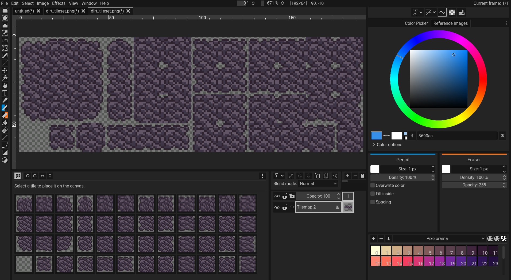
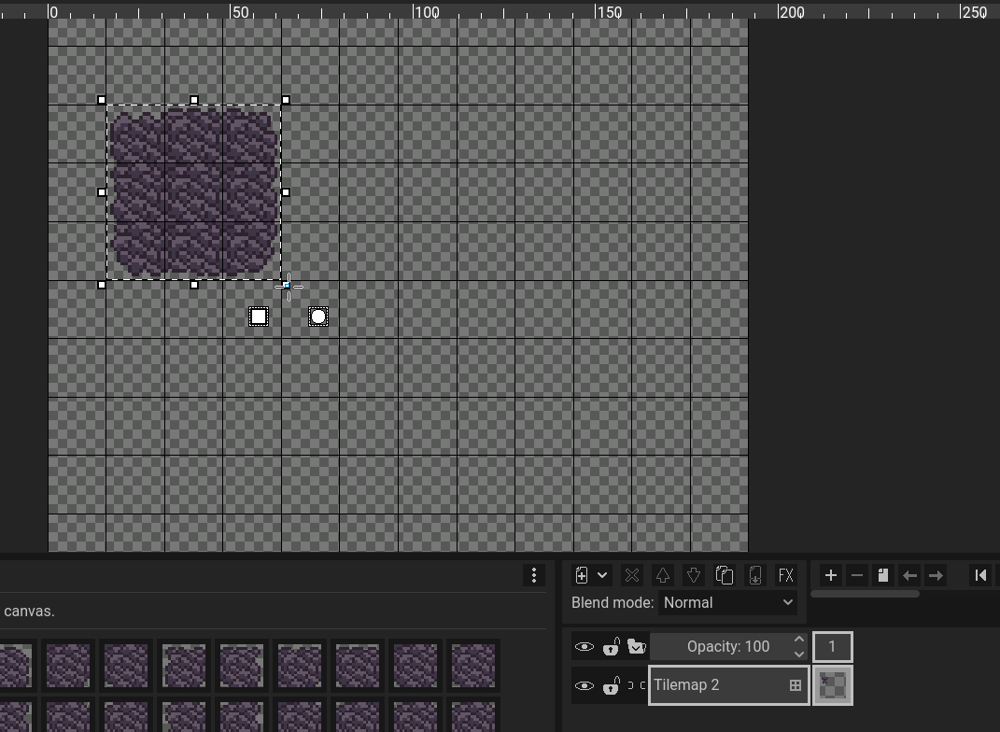

It is possible to create tilemaps in Pixelorama, in the form of tilemap [layers](../concepts/layer). Tilemap layers are a special type of pixel layer which use a tileset, and each cell of the grid has a reference to a tile from that tileset. Tilemaps are usually used when designing levels for games.

## Tileset
A tileset is essentially a collection of images of the same size, referred to as tiles. Each tile has an index number (a positive integer starting from 0), and they can be re-used multiple times, even in multiple tilemap layers, if they use the same tileset. Tilesets are created either automatically when creating a tilemap layer, or by [importing an image](import), and choosing to import it as a tileset. When saving a [project](../concepts/project), the tilesets are being stored inside the `.pxo` file. To see all of the available tilesets of a project, you can go to the Image menu and select Project Properties. From there, you can duplicate and delete tilesets. Note that you can only delete tilesets if they are not used by a tilemap layer.

## Creating a new tilemap layer
You can create a new tilemap layer by going to the top left side of the timeline, and clicking on the first button's arrow. That will bring up a menu of all available layer types. From there, choose "Tilemap layer". A window will appear with an option to choose which tileset the tilemap will use. If you have already created tilesets in this project, you can choose to use those in your new tilemap layer. Otherwise, your only option will be to create a new tileset. When creating a new tileset, you can choose its name and the size and shape of its individual tiles. Note that these **cannot** be changed later. It is possible, however, to change the tileset that the tilemap layer is using. To do that, you can right click on the tilemap layer in the timeline, select Properties, and choose a different tileset from the dropdown list. Note that this can be destructive if the new tileset has less tiles than the previous one.

:::tip Not just rectangles
Pixelorama supports rectangular, isometric and hexagonal tiles! Hexagonal tiles support both pointy-top and flat-top orientations. When the tile offset axis is set to horizontal, hexagonal tiles use pointy-top orientation, while if it's set to vertical, they use flat-top orientation.
:::

## Place-only mode
While it is not possible to change a **tileset**'s tile size & shape after it has been created, you can enable "Place-only mode" on a tilemap layer from its layer properties, which you can access by right clicking on the layer button in the timeline. Doing so, you can override the tileset's settings, and have a separate tile size and shape that is specific for this **tilemap layer**. This is useful mostly for creating isometric tilemaps, the tiles of which are larger than the isometric grid size, thus leading to pixels being outside each tile cell. Note that once this mode is enabled, **you will not be able to disable it**, and it will no longer be possible for you to draw regular pixels, or affect the tileset in any way. As the name of the mode implies, **you can only place already existing tiles**. However, you can still modify tiles in other tilemap layers that share the same tileset.

## Tiles panel
When a tilemap layer is selected, a new panel will appear in the user interface. From there, you can see all of the available tiles of the tileset, as well as some buttons that are related to the available editing modes.

:::caution panel not appearing
If the tiles panel does immediately become visible when switching to a tilemap layer, it has probably spawned as a tab next to the first available panel of the user interface, depending on your layout. If you are using a default layout, you can reset it by going to Window, Layouts, Reset. Otherwise, you will have to locate it by yourself and move it to the desired location manually.
:::

## Editing modes
Pixelorama offers two editing modes when using tilemap layers; Draw pixels and draw tiles. You can switch between them by clicking on the first button on the top left of the tiles panel, or by pressing <kbd>Shift + `</kbd>.

### Draw pixels
Draw pixels is the default mode, and is used to add/modify the tiles themselves, by drawing as you would on normal pixel layers. The draw pixels mode has three sub-modes, which can be toggled by the three buttons next to the draw tiles button, that are visible when draw pixels mode is active. Note that this mode is not available for tilemap layers using place-only mode.
| Mode name      | Description | Default Shortcut |
| ----------- | ----------- | ----------- |
| Manual | This mode modifies individual tiles, and immediately applies the change to all other instances of the modified tile(s) in the tilemap. It does not affect the order of tiles in the tileset. | <kbd>Shift + 1</kbd> |
| Auto | The default mode. This mode creates new tiles in the tileset when drawing, if the modified tiles do not already exist in the tileset. If they do, the tiles get re-used. Tiles that are no longer used anywhere in the tilemap get erased from the tileset. | <kbd>Shift + 2</kbd> |
| Stack | This mode creates new tiles in the tileset every time a tile gets modified, without changing any of the already existing tiles. | <kbd>Shift + 3</kbd> |

### Draw tiles
The draw tiles mode is used to place tiles directly from the tileset to the tilemap, without modifying the content of the tileset. To draw tiles, you can select a tile from the panel, and then use the pencil tool to place it on the canvas. Tiles can only be placed in grid cells, and not between them. You can also quickly rotate and flip the tiles by clicking on the arrow buttons next to the draw tiles button, or by pressing <kbd>Shift + Z</kbd> to rotate left, <kbd>Shift + X</kbd> to rotate right, <kbd>Shift + C</kbd> to flip horizontally and <kbd>Shift + V</kbd> to flip vertically.

:::tip random tiles
You can select multiple tiles from the Tiles panel, either by holding <kbd>Shift</kbd> or <kbd>Control</kbd> while clicking on them, just like you can with the timeline layer/frame/cel buttons. If you have multiple tiles selected, Pixelorama will randomly choose one of the selected tiles to place when drawing. If you want to change the probability of individual tiles, you can right click on a tile, select Properties, and change the probability slider. By default, all tiles have their probability set to `1`, meaning that all of them have an equal chance to appear when drawing.
:::

When this mode is used, the behavior of most tools changes.
| Tools      | Behavior in draw tiles mode |
| ----------- | ----------- |
| Pencil, bucket, line, curve and shape | Place tiles |
| Eraser | Remove tiles |
| Color picker | Quickly select a tile from the tilemap |
| Move | Moves the tilemap's offset along with its tiles |
| Selection | Select entire grid cells. Resizing a selection does not resize the pixels. Instead, it resizes the tile indices of the grid cells, placing more tiles if the selection is enlarged, or removing if it gets smaller. Note that this **only works with rectangular tiles**, and not isometric or hexagonal at the moment. |
 

