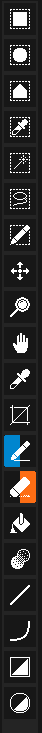
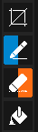
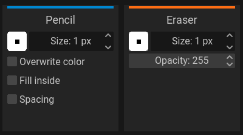

Tools are the main way to interact with your artwork.

##### Pixelorama's toolbar, located on the left side of the application window.

## Left and right mouse buttons
:::tip tools for left and right mouse buttons
Left clicking a tool will assign this tool to your left mouse button and right clicking it will assign the tool you clicked to your right mouse button. If you left click on the canvas, your left tool will be activated, and if you right click on the canvas, your right tool will be activated.
:::

In Pixelorama, you are given the ability to map a different tool to each mouse button, left and right. This essentially means that you can use a different tool with your left mouse button, and a different tool with your right mouse button. The two mouse buttons can be used **independently** of one another. In the toolbar, you will see one of the tool buttons having a half background on the left side of the button as **blue**. This represents the left mouse button, and it means that this specific tool has been **mapped to the left mouse button**. Similarly, the tool button with that has has a half background on the right side as **orange is mapped to the right mouse button**. If a tool button has both a blue and orange background, then this means that this tool has been mapped to both left and right mouse buttons.

So, to sum up, blue represents the left mouse button and orange represents the right mouse button. To map a tool to your left mouse button you can left click the button of the tool you want to map in the toolbar, and to map a tool to your right mouse button you can right click the tool button.

When you are on your [canvas](user_interface/canvas), if you left click, the tool that you left clicked on the toolbar will be used and if you right click, the tool that you right clicked will be used.

##### A screenshot example of the Pencil tool having a blue half background, which is mapped to the left mouse button and the Eraser tool having an orange half background, which is mapped to the right mouse button.

## The tools
These are all of the available tools in Pixelorama in order, from top to bottom.

### [The selection tools](selecting)
| Name      | Description | Default Shortcut |
| ----------- | ----------- | ----------- |
| Rectangular Selection | Create a rectangular selection.| L: <kbd>R</kbd>, R: <kbd> Alt + R</kbd> |
| Elliptical Selection | Create an elliptical selection. | L: <kbd>Y</kbd>, R: <kbd> Alt + Y</kbd> |
| Polygonal Selection | Create a polygonal selection. Click where you want each point of the polygon to be. Double click to end your polygon and finalize your selection area. | L: <kbd>K</kbd>, R: <kbd> Alt + K</kbd> |
| Select By Color | Selects all parts of the cel that share the same color.| L: <kbd>W</kbd>, R: <kbd> Alt + W</kbd> |
| Magic Wand | Selects the neighboring same-color area of the pixel the cursor was in on mouse button press. | L: <kbd>Q</kbd>, R: <kbd> Alt + Q</kbd> |
| Lasso / Free Select Tool | Selects a rough outline of an area. | L: <kbd>F</kbd>, R: <kbd> Alt + F</kbd> |
| Move | Moves the content of the active cel. Not a selection tool, see [transforming](transforming). | L: <kbd>T</kbd>, R: <kbd> Alt + T</kbd> |

### [Canvas](user_interface/canvas) navigation tools
| Name      | Description | Default Shortcut |
| ----------- | ----------- | ----------- |
| Zoom | Allows the user to change the zoom level of the canvas.| L: <kbd>Z</kbd>, R: <kbd> Alt + Z</kbd> |
| Pan | Allows the user to move around the canvas. | L: <kbd>M</kbd>, R: <kbd> Alt + M</kbd> |

### [Drawing tools and drawing-assisting tools](drawing)
| Name      | Description | Default Shortcut |
| ----------- | ----------- | ----------- |
| Color Picker | Get the color of the pixel on mouse position. | L: <kbd>O</kbd>, R: <kbd> Alt + O</kbd> |
| Pencil | Draw individual pixels on mouse position.| L: <kbd>P</kbd>, R: <kbd> Alt + P</kbd> |
| Eraser | Erase individual pixels on mouse position.| L: <kbd>E</kbd>, R: <kbd> Alt + E</kbd> |
| Bucket | Fill a same-color area or all of the pixels of the same color with a new color. | L: <kbd>B</kbd>, R: <kbd> Alt + B</kbd> |
| Shading | [See this page for a detailed explanation.](shading)| L: <kbd>U</kbd>, R: <kbd> Alt + U</kbd> |
| Line Tool | Create a straight line. | L: <kbd>L</kbd>, R: <kbd> Alt + L</kbd> |
| Rectangle Tool | Create a rectangle.| L: <kbd>S</kbd>, R: <kbd> Alt + S</kbd> |
| Ellipse Tool | Create an ellipse. | L: <kbd>C</kbd>, R: <kbd> Alt + C</kbd> |

Hovering your mouse over a tool button will reveal a small display that can give you more information about the tool.

## Tool options
Almost every tool has certain properties that the user can tweak, such as brush type and size, different modes, color or mirroring. The tool options are located in the right side of the application window and they are separated in left tool and right tool settings. These, of course, correspond to the two tools you have mapped at your two mouse buttons. The two colors are also mapped to different mouse buttons. The left one is for the left mouse button tool, and the right one is for the right mouse button tool.

:::tip Change mode quickly!
Most of the tools have some binary property that has to be changed often. Holding <kbd>Ctrl</kbd> will allow you to quickly alternate between the properties for a given tool as follows:
| Tool | Alternating Property |
| ---- | -------------------- |
| Zoom | zoom in / zoom out |
| Color picker | pick for left color / pick for right |
| Pencil | overwrite color on / off |
| Bucket | fill same color area / fill same color pixels |
| Shading | lighten / darken option |

:::

The tool options change every time the user changes the available tool, and most tools have their own unique options.

##### An example of tool options, for the Pencil and Eraser tool.

### Changing colors
On the above screenshot, on the top side, you can see two color buttons, for the left and right tools. To change them, you can either click on them and a color picker window will appear, or you can also choose a color from the palette. Left clicking a swatch from the palette will change the left color, and right clicking a swatch will change the right color. You can also switch between them by clicking on the double-arrow button above the two color buttons (also mapped to the <kbd>X</kbd> keyboard button by default). The small button below the two color buttons is used to change them back to the default colors, which are black for the left color, and white for the right color.
