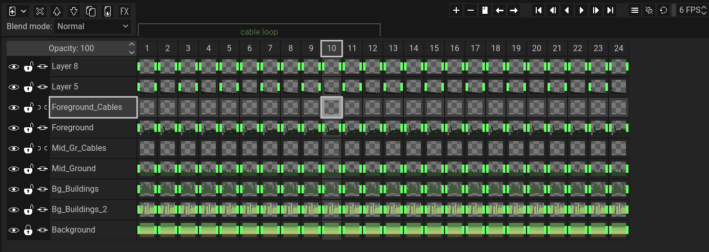

The timeline's main purpose is to help you with creating animations. It is composed of frames, which are used for creating animations, and layers, which help you separate your frames in different parts. Each frame is essentially a collection of multiple layers, and each individual intersection of a frame and a layer is called a [cel](../../concepts/cel). All frames have the same amount of layers.

## Animation
To preview your animation, you can click on the `Play` button (or press <kbd>F5</kbd>) located on the top right side of the timeline. The button on the left (mapped to <kbd>F4</kbd>) is used to preview the animation backward.

### FPS
On the top and far right side of the timeline, you will see a number, which has the default value of 6. This is the FPS, which stands for `Frames Per Second`. To put it simply, this is the speed of the animation and it determines how many frames are being shown for every second. Having a value of 6 FPS, for example, will display 6 frames every second the animation is running.

For more details, you can read this [Wikipedia article](https://en.wikipedia.org/wiki/Frame_rate).

### Loop modes
The button located directly on the left of the FPS is used to change the animation loop mode. There are three loop modes:
- Cycle loop. When the animation reaches the final frame, it will start playing again from the first frame. This is the default option.
- Ping-pong. When the animation reaches the final frame, it begins playing backward, starting from that final frame. When it reaches the first frame, it will again start playing forward until it reaches the final frame, and so on.
- No loop. When the animation reaches the final frame, it simply stops playing.

### Onion skinning
Directly on the left of the loop mode button, you will find two buttons used for onion skinning. Onion skinning is useful for animations because it's a simple and easy way to preview the previous and next frames at the same time as the frame you are currently editing. For more details, you can read this [Wikipedia article](https://en.wikipedia.org/wiki/Onion_skinning).

The button on the right simply toggles onion skinning on and off, and the one on the left brings up options, like the amount of past (previous) and future (next) frames that appear, and blue-red mode, which tints the previous frames blue, and the next frames red.

:::tip ignore onion skinning
If you want a layer to ignore onion skinning, you can right click on the layer button in the timeline, select "Properties" and enable the "Ignore in onion skinning" option.
:::

## Layers
On the left side of the timeline, you will see the layer buttons. Clicking on a layer button will select the current layer. Double-clicking will let you change the name of that layer. Right clicking a layer button will open up a menu, with options such as the layer's properties, and whether it's a clipping mask or not.

The layer buttons have three more buttons on them. The first toggles the layer's visibility. While invisible, the layer cannot be edited by the user. It will also remain invisible on export. The second locks and unlocks the layer. If the layer is locked, it cannot be edited by the user, but it does remain visible. The third button is used to automatically link the new cels that are being created. If it's toggled on, it is essentially a fast way to create linked cels.

There are 7 more buttons located on top of the layers. These, in order of appearance: add a new layer, remove the currently active layer, move the current layer up and down, clone the current layer, merge the current layer with the one directly below it, and open up a dialog for layer effects. Below these buttons, you can change the selected layer's blend mode and opacity.

## Frames
Directly above the cels, you will notice some buttons with each one having a number. These are the frame buttons, and the number they have is their order in the animation.

Clicking on a frame button will select that frame, and right-clicking a frame button will open up a menu. The menu options include frame properties, remove frame, clone frame, move frame to the left, move frame to the right, new tag, reverse frames (only works when multiple frames are selected), and center frames. Clicking on frame properties brings up a window that lets you change the duration of that frame, as well as set custom user-defined data.

:::tip frame duration
By default, the duration of each frame is set to 1x, which means it will take exactly as much time as the timeline FPS (frames per second). Setting it to 2x, for example, that frame will take twice as much time, while setting it to 0.5x will take half the time, meaning it will play out faster.
:::

You can also drag and drop frame buttons to re-arrange them. This will also affect their corresponding cels.

On the top side of the timeline, you will find frame-related buttons which offer the same functionality as the frame button right-click menu, like adding, removing, cloning and moving frames.

### Frame tags
Frame tags are used to organize different parts of your animated sprite. Those parts can also be exported independently using frame tags.

To create a new tag, you can right click on a frame button and select "New Tag". A popup will appear that lets you set a name for the tag, a color, the starting (from) and ending (to) frame, as well as custom user-defined data.

To edit an already existing tag, you can click on its name on the timeline, above the frame area. You can quickly move and resize it by dragging its edges.

If "Animation plays only on frames of the same tag" is toggled on in the timeline options, then, when you preview your animation, it will only preview the frames that belong on the same tag as the currently selected frame. This is a great way to preview parts of your animation separately.

## Cels
Cels are the intersection of layers and frames. For a more detailed explanation, you can [read this page](../../concepts/cel). To select a cel in order to draw on it, you can left-click on their respective button. The cel buttons take the most space in the timeline, and they are located to the right of the layer buttons and below the frame buttons. They also have a small preview of their image data on them.

Right-clicking on a cel button will bring up a menu, with options such as properties, link (or unlink) cel, and delete, which clears the content of the cel, making it fully transparent. In the cel properties, you can change their opacity (cel opacity is different than layer opacity), their z-index and also set custom user-defined data.

:::tip Selecting multiple cels
You can select/deselect multiple cels by holding the <kbd>Control</kbd> key and left-clicking individual cels, or hold the <kbd>Shift</kbd> key and left-click a cel to also select all of the cels between the one that was clicked and the one that has been selected last.

This also works on frame and layer buttons. For example, selecting two frame buttons using <kbd>Control</kbd> or <kbd>Shift</kbd> will select all of their cels as well. The same is true for layer buttons.
:::

:::tip Drag and drop
You can drag and drop layer, frame and cel buttons to re-arrange them. Re-arranging frame and layer buttons also affects their cels.
:::
