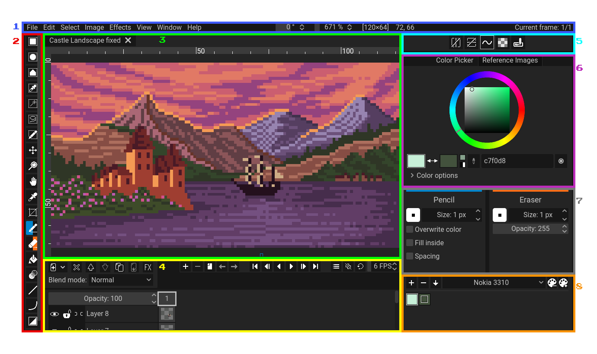

Pixelorama aims for a simplistic and understandable, yet professional User Interface (from now on referred as "UI"). Optimized for quick access to everything, Pixelorama's UI looks like this:

##### A screenshot of Pixelorama's UI which has been edited to have its interface numbered. Note that the image above is the default look of Pixelorama (Dark Theme) after you have closed the splash screen.

Now, let's categorize the common elements of which the UI is consisted of and give everything a short description.

- **1** - The traditional [top bar](topbar) with menus found in most windowed applications.
- **2** - The [toolbar](toolbar). The area where you can select a tool to work with.
- **3** - Project tabs. This is where you will find all of your currently opened projects and switch between them by clicking on their respective tab.
- **4** - The [timeline](timeline). This is where you will find the sprite's layers and frames for animation.
- **5** - A small [canvas preview](canvas_preview). There you can also preview your animation independently from your main canvas.
- **6** - The [tool options](toolbar/#tool-options). This is where you can configure some settings of your currently active tools, as well as select your left and right colors.
- **7** - The [palettes](palettes). Useful for easily picking pre-set colors.

:::tip Even More Panels!!!
There are also other panels in pixelorama but they are hidden by default.
:::

Located in the middle of your view, the [canvas](canvas) is the "sheet" on which you are creating your artwork. This is the main area of the workspace because this is where you will be doing all of the drawing.

Each UI element has its own detailed page in the documentation, where it is analyzed in depth.

## Changing theme
By default, the dark theme is enabled on Pixelorama. You can select another by going to the Edit menu on the top bar, selecting Preferences and clicking on the `Interface` tab on the left.
