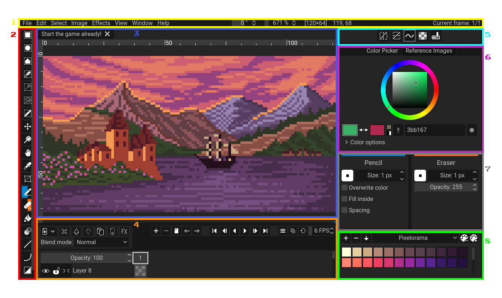

Pixelorama aims for a simplistic and understandable, yet professional User Interface (from now on referred as "UI"). Optimized for quick access to everything, Pixelorama's UI looks like this:

##### A screenshot of Pixelorama's UI which has been edited to have its interface numbered. Note that the image above is the default look of Pixelorama (Dark Theme) after you have closed the splash screen.

Now, let's categorize the common elements of which the UI is consisted of and give everything a short description.

- **1** - The traditional top bar with menus found in most windowed applications.
- **2** - The [toolbar](../tools). The area where you can select a tool to work with.
- **3** - Project tabs. This is where you will find all of your currently opened projects and switch between them by clicking on their respective tab.
- **4** - The [timeline](timeline). This is where you will find the sprite's layers and frames for animation.
- **5** - A small canvas preview. There you can also preview your animation independently from your main canvas.
- **6** - The color pickers, where you can change the colors of the left and right tools.
- **7** - The global tool options, which contain some settings such as mirroring, pixel perfect and dynamics that are being shared between both the left and the right tool.
- **8** - The [tool options](../tools/#tool-options). This is where you can configure some settings of your currently active tools.
- **9** - The [palettes](../palettes). Useful for easily picking pre-set colors.

:::tip Hidden panels
There are even more panels in Pixelorama, but they are hidden by default. To make them visible, you can go to the top bar menu, select Window, Panels, and toggle on the panels you wish to make visible. You can hide them by toggling them off the same way.
:::

Located in the middle of your view, the [canvas](canvas) is the "sheet" on which you are creating your artwork. This is the main area of the workspace because this is where you will be doing all of the drawing.

Each UI element has its own detailed page in the documentation, where it is analyzed in depth.

## Changing theme
By default, the dark theme is enabled on Pixelorama. You can select another by going to the Edit menu on the top bar, selecting Preferences and clicking on the `Interface` tab on the left.

## UI customization
The user interface of Pixelorama is very customizable, allowing you to re-arrange the panels however you want. To move a panel, you have to enable "Moveable Panels" from the Window menu (or press F9, which is its default shortcut). This will make each panel have their own tab. Click with your left mouse button (or touch, if you are using a touch screen) on the tab of the panel you wish to move, and drag it to the area you want to move it to. A highlight will appear while dragging, which lets you know of the space the panel will take once you finish dragging. Release your mouse button (or your finger) to move the panel to its new position.

## UI layouts
You also have the ability to make custom layouts of the user interface. You can change the layout by going to the Window menu, and selecting a layout from the Layouts submenu. If you want to save the current state of the UI as a layout, you can go to the Window menu, and, under Layouts, select "Manage Layouts". A dialog will appear, where you can add a new layout that is based of the current state of the user interface, and you can rename and delete other layouts. Clicking on a layout in that dialog will show a preview of how that layout looks like, and double clicking it will apply it to the UI.